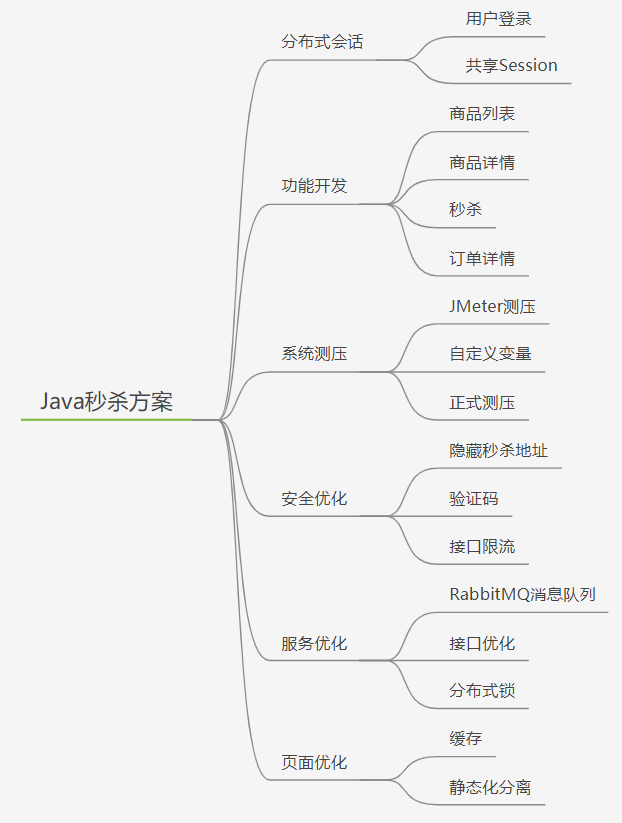

# 如何设计一个秒杀系统



秒杀其实主要解决两个问题：一个是并发读，一个是并发写

* 并发读：尽量减少用户到服务端“读”数据

* 并发写：在数据库层面独立出来一个库，做特殊的处理

秒杀整体架构可以概括为 稳，准，快 几个关键字

* 稳：整个系统架构要满足高可用
* 准：保证数据的一致性
* 快：系统的性能要足够高

高可用，一致性，高性能

# 两次MD5加密

客户端：PASS=MD5(明文+固定Salt)

服务端：PASS=MD5(用户输入+随机Salt)

用户端MD5加密是为了防止用户密码在网络中明文传输，服务端MD5加密是为了提高密码的安全性

```xml
<!--md5-->
<dependency>
    <groupId>commons-codec</groupId>
    <artifactId>commons-codec</artifactId>
</dependency>
<dependency>
    <groupId>org.apache.commons</groupId>
    <artifactId>commons-lang3</artifactId>
</dependency>
```

# 参数校验

每个类都写大量的健壮性判断过于麻烦，使用`validation`简化代码

```xml
<!--validation组件-->
<dependency>
    <groupId>org.springframework.boot</groupId>
    <artifactId>spring-boot-starter-validation</artifactId>
</dependency>
```

自定义注解

# 异常处理

异常包括编译时异常和运行时异常，前者通过捕获异常从而获取异常信息，后者主要通过规范代码开发

在开发中，每一层都可能抛出异常，SpringMVC能将所有类型的异常从处理过程中解耦出来，既保证了相关处理过程的功能单一，也实现了异常信息的统一处理和维护

两种全局异常处理方式

* `@ControllerAdvice`和`@ExceptionHandler`注解
* `ErrorController类`

区别：

* `@ControllerAdvice`方式只能处理控制器抛出的异常，此时请求已经进入控制器中
* `ErrorController类`方式可以处理所有的异常，包括未进入控制器的错误
* 如果应用中两者共同存在，则`@ControllerAdvice`方式处理控制器抛出的异常，`ErrorController类`方式处理未进入控制器的异常
* `@ControllerAdvice`方式可以定义多个拦截方式，拦截不同的异常类，并且可以获取抛出的异常信息，自由度更大

# 分布式Session

```markdown
# Session复制
* 优点
	* 无需修改代码,只需要修改Tomcat配置
* 缺点
	* Session同步传输占用内网带宽
	* 多台Tomcat同步性能指数下降
	* Session占用内存,无法有效水平扩展

# 前端存储
* 优点
	* 不占用服务端内存
* 缺点
	* 存在安全风险
	* 数据大小受cookie限制
	* 占用外网带宽

# Session粘滞
* 优点
	* 无需修改代码
	* 服务端可以水平扩展
* 缺点
	* 增加新机器,会重新Hash,导致重新登陆
	* 应用重启,需要重新登录

# 后端集中存储
* 优点
	* 安全
	* 容易水平扩展 
* 缺点
	* 增加复杂度
	* 需要修改代码
```

## Redis方案

```xml
<!--redis-->
<dependency>
    <groupId>org.springframework.boot</groupId>
    <artifactId>spring-boot-starter-data-redis</artifactId>
</dependency>
<!--对象池依赖-->
<dependency>
    <groupId>org.apache.commons</groupId>
    <artifactId>commons-pool2</artifactId>
</dependency>
<!--spring-session,只需要添加这个依赖,配置redis,session就会存到redis中-->
<!--<dependency>-->
<!--<groupId>org.springframework.session</groupId>-->
<!--<artifactId>spring-session-data-redis</artifactId>-->
<!--</dependency>-->
```


